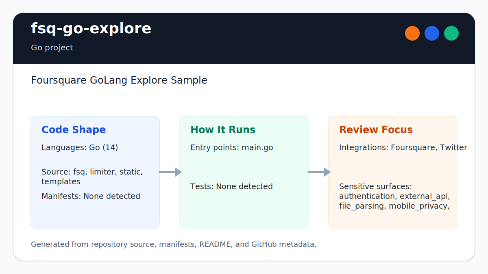

# fsq-go-explore

<!-- README-OVERVIEW-IMAGE -->


## Overview

`garethpaul/fsq-go-explore` is a Go project. Foursquare GoLang Explore Sample

This README is based on the checked-in source, manifests, scripts, and repository metadata on the `master` branch. The project language mix found during review was: Go (14).

## Repository Contents

- `README.md` - project overview and local usage notes
- `CHANGES.md` - concise history of maintenance changes
- `Makefile` - local verification entry point
- `go.mod` and `go.sum` - Go module dependency metadata
- `fsq` - source or example code
- `limiter` - source or example code
- `scripts/check-baseline.sh` - Go formatting, test, import, and credential/privacy-log checks
- `SECURITY.md` - security reporting and disclosure guidance
- `static` - source or example code
- `templates` - source or example code
- `VISION.md` - project direction and maintenance guardrails

Additional scan context:

- Source directories: fsq, limiter, static, templates
- Dependency and build manifests: go.mod, go.sum
- Entry points or build surfaces: main.go, app.yaml
- Test-looking files: auth_test.go, search_test.go, fsq/api_test.go, fsq/keys_test.go

## Getting Started

### Prerequisites

- Git
- Go 1.25 or a compatible modern Go toolchain

### Setup

```bash
git clone https://github.com/garethpaul/fsq-go-explore.git
cd fsq-go-explore
go mod download
```

The setup commands above are derived from repository files. Legacy mobile, Python, or JavaScript samples may require older SDKs or package versions than a modern workstation uses by default.

## Running or Using the Project

- This is a legacy Google App Engine sample. Use the App Engine tooling that
  matches `app.yaml` for local serving or deployment.
- Configure `FSQ_CLIENT_ID`, `FSQ_CLIENT_SECRET`, and `FSQ_VERSION` through the
  environment or deployment configuration. Do not commit real values.

## Testing and Verification

Run the baseline:

```bash
make lint
make test
make build
make check
```

The `lint`, `test`, and `build` targets currently delegate to the static
baseline so formatting, tests, and static guardrails stay together. The baseline
runs `go test ./...`, verifies Go formatting, checks that module imports are
used instead of GOPATH-era local imports, and guards against credential- and
location-adjacent logging. It also covers state-changing venue edit submissions
so non-POST requests are rejected before auth or Foursquare API work, and
missing venue IDs are rejected before auth, template parsing, or venue API
requests. Malformed edit forms are rejected before auth-cookie lookup or
Foursquare edit work. Search query and location values are trimmed and
length-bounded before venue search requests are built. OAuth callbacks reject
missing authorization codes before exchange work starts. Auth cookies must carry
generated user cache keys before access-token memcache lookup starts. ETag
comparisons are exact, so partial `If-None-Match` values cannot trigger cached
`304` responses.
Protected routes validate generated auth cookie cache keys before calling
handler code.
Foursquare JSON response bodies are limited to 2 MiB before envelope or venue
decoding so an unexpectedly large upstream response cannot grow process memory
without an application boundary.
Non-2xx Foursquare search and venue detail responses are rejected before JSON decoding,
so error envelopes cannot populate successful venue result structures.
The in-process limiter retains at most 10,000 rate-limiter keys and evicts the
least recently used key when request-controlled key material reaches that cap.
Each bucket permits a burst of `Max` requests and refills those `Max` requests
over `TTL`; non-positive rate configurations reject requests rather than
becoming unlimited.

GitHub Actions installs the exact Go version from `go.mod` and runs formatting,
vet, tests, module-integrity checks, and the static security baseline for
pushes, pull requests, and manual dispatches. The workflow uses read-only
permissions and credential-free checkout.

When the required SDK or runtime is unavailable, use static checks and source review first, then verify on a machine that has the matching platform toolchain.

## Configuration and Secrets

- Required Foursquare settings: `FSQ_CLIENT_ID`, `FSQ_CLIENT_SECRET`, and
  `FSQ_VERSION`.
- Keep API keys, OAuth credentials, access tokens, `.env` files, and
  deployment-specific config out of source control.

## Security and Privacy Notes

- Review changes touching authentication or token handling; examples from the scan include auth.go, limiter/config/config.go, limiter/limiter.go, main.go.
- Review changes touching external API calls or credential-adjacent configuration; examples from the scan include auth.go, edit.go, fsq/api.go, fsq/common.go, and 6 more.
- Review changes touching network requests, sockets, or service endpoints; examples from the scan include auth.go, fsq/api.go, fsq/common.go, fsq/venue.go, and 3 more.
- Review changes touching file, media, JSON, XML, CSV, OCR, or data parsing; examples from the scan include auth.go, fsq/api.go, fsq/common.go, fsq/keys.go, and 3 more.
- Cache keys are deterministic SHA-256 digests and should not expose raw query,
  token, or user fields.
- OAuth login uses per-request state values and HTTP-only cookies for callback
  validation.
- OAuth callbacks with matching state still fail before token exchange; missing OAuth authorization codes are rejected.
- Auth cookie values are validated as generated user cache keys before memcache
  lookup, so malformed cookie values do not reach access-token cache work.
- Protected routes validate generated auth cookie cache keys before handler
  work starts.
- Venue edit submissions are POST-only; non-POST requests receive `405 Method
  Not Allowed`.
- Missing venue IDs are rejected with `400 Bad Request` before edit-page auth,
  template parsing, or Foursquare venue detail/edit API work.
- Malformed venue edit forms are rejected with `400 Bad Request` before
  auth-cookie lookup, token cache work, or Foursquare edit API work.
- Venue edit request bodies are limited to 64 KiB and oversized submissions
  receive `413 Request Entity Too Large` before auth or Foursquare work.
- Search query and location parameters are length-bounded before being sent to
  Foursquare or used in cache keys.
- ETag comparisons are exact before `304 Not Modified` responses are returned.

## Maintenance Notes

- Run `make lint`, `make test`, `make build`, and `make check` before pushing
  changes that touch Foursquare API calls, OAuth, cache keys, rate limiting, or
  App Engine imports.
- See `SECURITY.md` for vulnerability reporting and safe research guidance.
- See `VISION.md` for project direction and contribution guardrails.
- See `docs/plans/2026-06-09-fsq-propose-edit-post-only.md` for the venue edit
  method guard.
- See `docs/plans/2026-06-09-fsq-venue-id-boundary.md` for the venue ID request
  boundary.
- See `docs/plans/2026-06-09-fsq-edit-page-id-first.md` for the edit-page
  malformed-request boundary.
- See `docs/plans/2026-06-09-fsq-propose-edit-form-parse-boundary.md` for the
  venue edit form-parse boundary.
- See `docs/plans/2026-06-09-fsq-search-param-length.md` for search parameter
  length guardrails.
- See `docs/plans/2026-06-09-fsq-oauth-code-boundary.md` for the OAuth callback
  authorization-code boundary.
- See `docs/plans/2026-06-09-fsq-go-make-gate-aliases.md` for local
  verification target guardrails.
- See `docs/plans/2026-06-09-fsq-user-cache-key-boundary.md` for the auth
  cookie user cache key boundary.
- See `docs/plans/2026-06-09-fsq-login-protect-cache-key.md` for protected
  route auth-cookie cache-key validation.
- See `docs/plans/2026-06-09-fsq-etag-exact-match.md` for the header cache ETag
  matching boundary.
- See `docs/plans/2026-06-10-ci-baseline.md` for the GitHub Actions `make
  check` baseline.
- See `docs/plans/2026-06-10-fsq-rate-limiter-key-cap.md` for the bounded
  in-process rate-limiter key registry.
- See `docs/plans/2026-06-12-fsq-rate-limiter-refill.md` for token-bucket refill
  and invalid-configuration behavior.
- See `docs/plans/2026-06-12-fsq-edit-body-limit.md` for the venue edit request
  body boundary.
- See `docs/plans/2026-06-13-fsq-response-body-limit.md` for the Foursquare JSON
  response parse boundary.
- See `docs/plans/2026-06-13-fsq-response-status-validation.md` for upstream
  search and venue detail status validation.

## Contributing

Keep changes small and tied to the project that is already present in this repository. For code changes, document the toolchain used, avoid committing generated dependency directories or local configuration, and update this README when setup or verification steps change.
